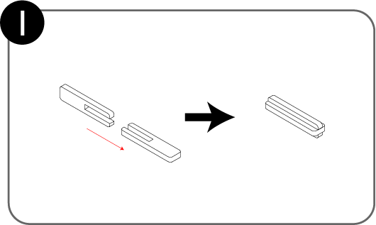
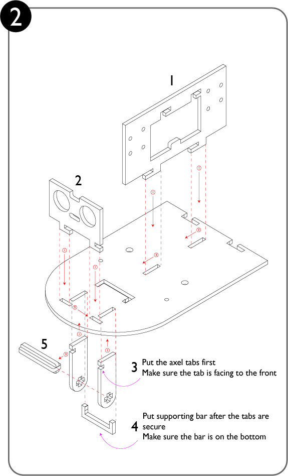
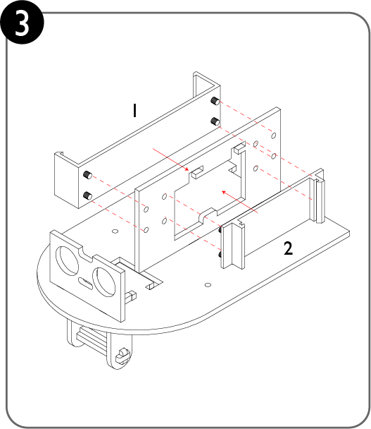
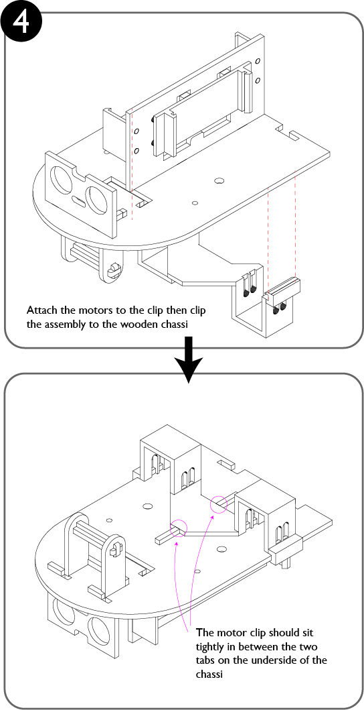
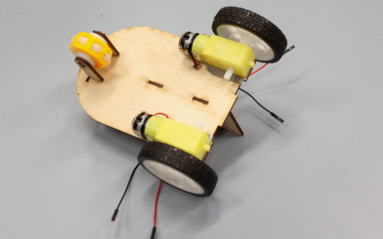
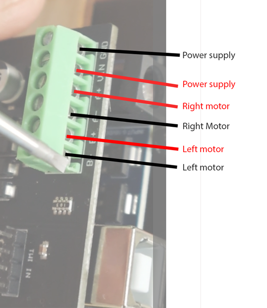
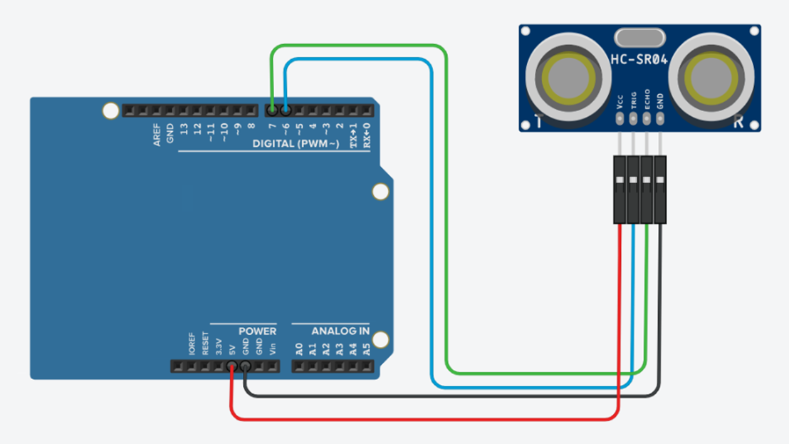

# Assembly Instructions

> [!Important]
> Before students begin, they should know:
>
> 1. During assembly, no parts should be forced, excessive force will break the components.
> 2. The motors should not be manually turned as it will break the plastic gears (that means no pushing and pulling the robot on the ground like a Tonka truck).
> 3. The robots battery power should always be turned off when connecting to a computer.
> 4. Make sure your robot has room to move and won't be stepped on when testing.
> 5. Batteries should be always removed for storage

## Step 1

**Assemble to axel for the front wheel.**



## Step 2

**Slide the omni wheel onto the middle of the axel.**


**Assemble the main chassis.**



## Step 3

**Attach the 3D Printed brackets for the battery holder and Microcontroller.**



## Step 4

**First insert the two motors into the 3D motor clip.**


**Second attach the motor clip to the chassis.**



## Step 5

**Attach the wheels to the motors.**



## Step 6

**Connect the wires to the screw terminals.**



## Step 7

**Attach the ultrasonic sensor to the robot and connect it to the processor.**



## Step 8 - Test the Hardware

1. Make sure your battery power switch is off.
2. Navigate to [https://lab-micropython.arduino.cc/](https://lab-micropython.arduino.cc/).
3. Sign in with Google (use your @education.nsw.gov.au account).
4. Follow these instructions to connect:


5. Copy and paste this code into `main.py`
6. Click <kbd>SAVE</KDB>
7. Disconnect your robot from your computer

> [!Caution]
> To avoid damaging your computer or robot place it on the floor in an area with enough space for it to move safely before powering it on.

```python
from aidriver import AIDriver, hold_state
import aidriver

"""Hardware sanity test for the AIDriver robot.

Runs a short sequence of movements and distance readings.
Most details are reported via the AIDriver debug logger.
"""


def main():
    aidriver.DEBUG_AIDRIVER = True

    print("Initialising AIDriver hardware test...")

    try:
        robot = AIDriver()
    except Exception as exc:
        print("Failed to initialise AIDriver:", exc)
        print("Check that 'aidriver.py' is in the 'lib' folder on the device.")
        return

    print("Starting tests in 3 seconds. Ensure clear space around the robot.")
    hold_state(3)

    # Test 1: Drive Forward
    print("Test 1: drive_forward")
    robot.drive_forward(200, 200)
    hold_state(2)
    robot.brake()
    hold_state(1)

    # Test 2: Drive Backward
    print("Test 2: drive_backward")
    robot.drive_backward(200, 200)
    hold_state(2)
    robot.brake()
    hold_state(1)

    # Test 3: Rotate Right
    print("Test 3: rotate_right")
    robot.rotate_right(200)
    hold_state(2)
    robot.brake()
    hold_state(1)

    # Test 4: Rotate Left
    print("Test 4: rotate_left")
    robot.rotate_left(200)
    hold_state(2)
    robot.brake()
    hold_state(1)

    # Test 5: Ultrasonic Sensor
    print("Test 5: ultrasonic distance readings")
    for i in range(5):
        distance = robot.read_distance()
        hold_state(0.5)

    print("All hardware tests completed.")


if __name__ == "__main__":
    main()
```
