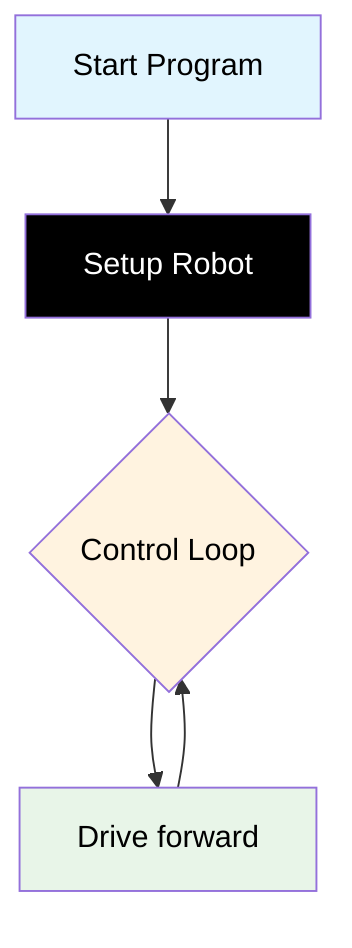

# Challenge 1

In this challenge students will create their first mechatronics program and balance the motors so their robot drives in a straight line.

## Success Criteria

My robot moves is a straight line.

## Before You Begin

1. Complete [Module 1: Write your first program!](https://groklearning.com/learn/python-for-beginners/1/0/) to learn the basics of the Python language.
2. Complete [Blockly Level 1](https://blockly.games/maze?lang=en&level=1&&skin=0) to apply the algorithm visually.

## Flowchart Of The Algorithm



## Step 1

1. Make sure your power switch is off.
2. Navigate to [https://lab-micropython.arduino.cc/](https://lab-micropython.arduino.cc/).
3. Sign in with Google (use your @education.nsw.gov.au account).
4. Follow these instructions to connect, code and save:


## Step 2

Edit `main.py` so the top of your program imports the dependencies and instantiate (programming metalanguage for create) a copy of the AIDriver class (pre-written values and functions) that will be referred to as `my_robot` in your program.

In mechatronics this is called the setup routine, this is where your robot is configured and necessary variables assigned values, ready for your control loop.

```python
from time import sleep
from aidriver import AIDriver

my_robot = AIDriver()
```

## Step 3

Add a `while` loop, the while loop runs forever and will contain the main program of your robot.

In mechatronics this is called your control loop or loop.

```python
from time import sleep
from aidriver import AIDriver

my_robot = AIDriver()

while True:
    #Write code here
```

## Step 4

Add the drive forward command and a short sleep command so the processor has time to respond.

The code `my_robot.drive_forward(200, 200)` is an instruction to drive the robot forward with a speed setting of 200 on the left wheel and a speed setting of 200 on the right wheel. You can set the speed an where between 0 (slowest) and 255 (fastest).

> [!Important]
>
> 1. You will find anything below 120 is not enough power to the wheels so they may not respond to lower values.
> 2. high speed makes gives your system less time to make decisions and respond, you will find a speed around 200 optimal for all the challenges.

```python
from time import sleep
from aidriver import AIDriver

my_robot = AIDriver()

while True:
    my_robot.drive_forward(200, 200)
    sleep(0.1)
```

## Step 5

> [!CAUTION]
> Save your `main.py` and disconnect your robot from your computer, then find some space to safely allow your robot to move, before powering it on.

Your challenge is to balance the motors. Because of a range of factors the motors won't equally respond to the same speed value. You task is to test the adjust the values of 200 & 200 find the optimal values to get your robot to drive in a straight line.

> [!TIP]
>
> - If your robot pulls to the right you need to either increase the right wheel speed or decrease the left wheel speed. ie `my_robot.drive_forward(200, 204)`
> - If your robot pulls to the left you need to either increase the left wheel speed or increase the right wheel speed. ie `my_robot.drive_forward(200, 196)`
> - Keep adjusting the speed values until your robot drives as straight as possible over a few tests.

## Step 7 Save your Code

1. Copy all your code from `main.py`.
2. Paste it in your portfolio under "Challenge 1".
