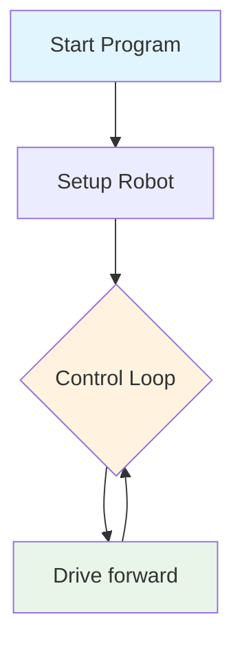

# Challenge 1

In this challenge students will create their first mechanic program and balance the motors so their robot drives in a straight line.

## Success Criteria

My robot moves is a straight line.

## Flowchart Of The Algorithm



## Step 1

1. Make sure your power switch is off
2. Plug in your robot
3. Navigate [https://lab-micropython.arduino.cc/](https://lab-micropython.arduino.cc/)]

## Step 2

At the top of your program import the dependencies and instantiate (programming metalanguage for create) a copy of the AIDriver class (pre-written values and functions) that will be refered to `my_robot`.

In mechatronics this is called teh setup routine, this is where your robot is configured ready for your control loop.

```python
from time import sleep
from aidriver import AIDriver

my_robot = AIDriver()
```

## Step 3

Add a `while` loop, the while loop runs forever and will contain the main program of your robot.

In mechatronics this is called your control loop or loop.

```python
from time import sleep
from aidriver import AIDriver

my_robot = AIDriver()

while True:
    #Write code here
```

## Step 4

Add the drive forward command and a short sleep command so the processor has time to respond.

The code `my_robot.drive_forward(200, 200)` is an instruction to drive the robot forward with a speed setting of 200 on the left wheel and a speed setting of 200 on the right wheel. You can set the speed an where between 0 (slowest) and 255 (fastest).

> [!Important]
>
> 1. You will find anything below 120 is not enough power to the wheels so they may not respond to lower values.
> 2. high speed makes gives your system less time to make decisions and respond, you will find a speed around 200 optimal for all the challenges.

```python
from time import sleep
from aidriver import AIDriver

my_robot = AIDriver()

while True:
    my_robot.drive_forward(200, 200)
    sleep(0.1)
```

## Step 5

Upload to test your code

# Step 6

Your challenge is to balance the motors. Because of a range of factors the motors won't equally respond to the same speed value. You task is to adjust the values of 200 & 200 to get your robot to drive in a straight line.

> [tip]
>
> - If your robot pulls to the right you need to either increase the right wheel speed or decrease the left wheel speed. ie `my_robot.drive_forward(200, 204)`
> - If your robot pulls to the left you need to either increase the left wheel speed or increase the right wheel speed. ie `my_robot.drive_forward(200, 196)`
> - Keep adjusting the speed values until your robot drives as straight as possible over a few tests.
