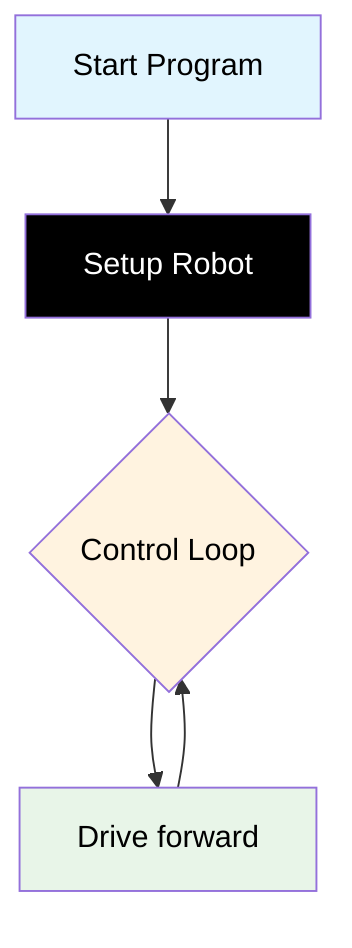
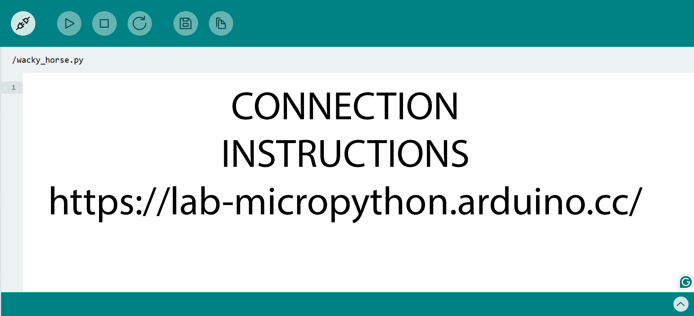

# Challenge 1

In this challenge students will create their first mechatronics program and balance the motors so their robot drives in a straight line.

## Success Criteria

My robot moves is a straight line.

## Before You Begin

1. Complete [Module 1: Write your first program!](https://groklearning.com/learn/python-for-beginners/1/0/) to learn the basics of the Python language.
2. Complete [Blockly Level 1](https://blockly.games/maze?lang=en&level=1&&skin=0) to apply the algorithm visually.

## Flowchart Of The Algorithm



## Step 1

1. Make sure your battery power switch is off.
2. Navigate to [https://lab-micropython.arduino.cc/](https://lab-micropython.arduino.cc/).
3. Sign in with Google (use your @education.nsw.gov.au account).
4. Follow these instructions to connect, code and save:



## Step 2

Edit `main.py` so the top of your program imports the dependencies and instantiate (programming metalanguage for create) a copy of the AIDriver class (pre-written values and functions) that will be referred to as `my_robot` in your program.

In mechatronics this is called the setup routine, this is where your robot is configured and necessary variables assigned values, ready for your control loop.

```python
from time import sleep
import aidriver
from aidriver import AIDriver

aidriver.DEBUG_AIDRIVER = True
my_robot = AIDriver()
```

If you get stuck or see error messages, see `Common_Errors.md`.

## Step 3

Add a `while` loop, the while loop runs forever and will contain the main program of your robot.

In mechatronics this is called your control loop or loop.

```python
from time import sleep
import aidriver
from aidriver import AIDriver

aidriver.DEBUG_AIDRIVER = True
my_robot = AIDriver()

while True:
    #Write code here
```

If you get an error you don’t recognise, check `Common_Errors.md`.

## Step 4

Add the drive forward command and a short sleep command so the processor has time to respond.

The code `my_robot.drive_forward(200, 200)` is an instruction to drive the robot forward with a speed setting of 200 on the left wheel and a speed setting of 200 on the right wheel. You can set the speed an where between 0 (slowest) and 255 (fastest).

> [!Important]
>
> - Any value below 120 typically doesn't provide enough power to the wheels, so the motors may not respond reliably at lower speeds.
> - Higher speeds give your robot less time to make decisions and react.
> - A speed around 200 is generally optimal for completing all the challenges.

```python
from time import sleep
import aidriver
from aidriver import AIDriver

aidriver.DEBUG_AIDRIVER = True
my_robot = AIDriver()

while True:
    my_robot.drive_forward(200, 200)
    sleep(0.1)
```

If the code doesn’t run or you see an error, see `Common_Errors.md`.

## Step 5

> [!Caution]
> To avoid damaging your computer or robot, first save your main.py file. Next, disconnect your robot from your computer, then place it on the floor in an area with enough space for it to move safely before powering it on.

Your challenge is to balance the motors. Due to various factors, the motors may not respond equally to the same speed value. Your task is to experiment with and adjust the initial values of 200 & 200 to find the optimal settings that allow your robot to drive in a straight line.

> [!Tip]
>
> - If your robot veers to the right, either increase the speed of the right wheel or decrease the speed of the left wheel (e.g., my_robot.drive_forward(200, 204)).
> - If your robot veers to the left, either increase the speed of the left wheel or decrease the speed of the right wheel (e.g., my_robot.drive_forward(204, 200)).
> - Continue fine-tuning the speed values and testing until your robot moves as straight as possible.

## Debugging Tips – Test Small, Test Often

- Run your code after every **3–5 lines** you change.
- If something confusing happens, temporarily add:

  ```python
  print("HERE 1")
  ```

  to check if that part of the code is running.

- For Challenge 1, always start from your **last working version** and make small adjustments to the speeds.

## Step 7 Save your Code

1. Copy all your code from `main.py`.
2. Paste it in your portfolio under "Challenge 1".
