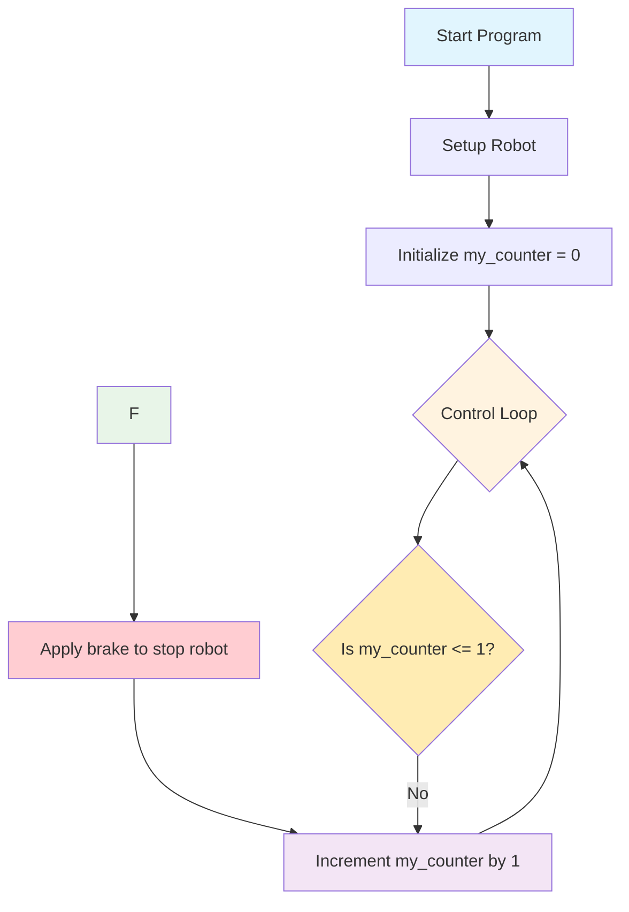

# Challenge 2

In this challenge students will further modify their existing code to make their robot move in a perfect circle less than 1.5m diameter and stop.

## Success Criteria

My robot moves in circle and comes to a stop.

## Flowchart Of The Algorithm



## Step 1

1. Make sure your power switch is off
2. Plug in your robot
3. Navigate [https://lab-micropython.arduino.cc/](https://lab-micropython.arduino.cc/)]

## Step 2

Because the control loop runs forever, we need a logic control structure, so it only runs once then it is skipped by the loop.

```python
from time import sleep
from aidriver import AIDriver

my_robot = AIDriver()

my_counter = 0

while True:
    if my_counter <= 1:
        # This indented code will only run if the above statement is true
        my_robot.drive_forward(200, 200)
        sleep(0.1)
        my_robot.brake()
        sleep(1)
    my_counter = my_counter + 1
    sleep(0.1)
```

## Step 3

Adjust the speed settings and sleep duration so your robot moves in a circle for the approximate time required to drive 1 complete circle.

## Challenge 2 extensions, I can…

1. Drive a circle both directions.
2. Drive a circle in reverse.
3. Drive 2, 3, 4 circles
4. Drive a figure 8.
5. Drive a circle in reverse.
6. Drive 2, 3, 4 circles
7. Drive a figure 8.
