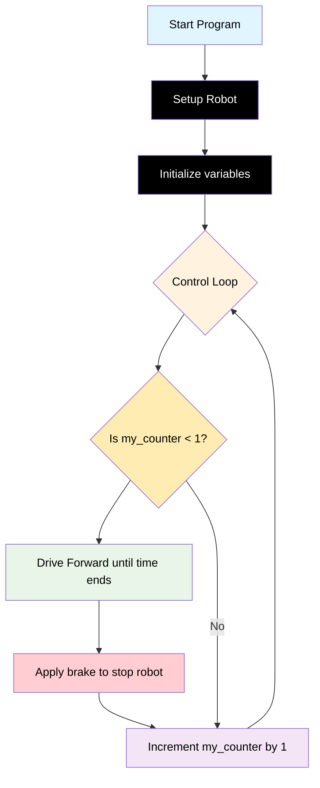

# Challenge 2

In this challenge students will further modify their existing code to make their robot move in a perfect circle less than 1.5m diameter and stop.

## Success Criteria

My robot moves in circle and comes to a stop.

## Before You Begin

1. Complete [Module 2: Calculations and Turtle!](https://groklearning.com/learn/python-for-beginners/2/0/) to learn about mathematical calculations in the Python language.
2. Complete [Blockly Level 3 to apply the run once algorythm algorithm visually](https://blockly.games/maze?lang=en&level=3&&skin=0).

## Flowchart Of The Algorithm



## Step 1

1. Make sure your power switch is off.
2. Navigate to [https://lab-micropython.arduino.cc/](https://lab-micropython.arduino.cc/).
3. Sign in with Google (use your @education.nsw.gov.au account).
4. Follow these instructions to connect, code and save:


## Step 2

Because the control loop runs forever, we need a logic control structure, so it only runs once then it is skipped by the loop.

```python
from time import sleep
from aidriver import AIDriver

my_robot = AIDriver()

my_counter = 0
wheel_speed = 180
speed_adjust = 0
move_time = 0

while True:
    if my_counter < 1:
        # This indented code will only run if the above statement is true
        my_robot.drive_forward(wheel_speed - speed_adjust, wheel_speed + speed_adjust)
        sleep(move_time)
        my_robot.brake()
        sleep(1)
    my_counter = my_counter + 1
    sleep(0.1)
```

## Step 3

Look at the maths for the Adjust the `my_robot.drive_forward(l, r)` and adjust the vales assigned to `wheel_speed` and `speed_adjust` to make your robot move in the required circle size, then adjust the value assigned to `move_time` so the robot moves for the approximate time required to drive 1 complete circle.

## Step 4 Save your Code

1. Copy all your code from `main.py`.
2. Paste it in your portfolio under "Challenge 2".

## Step 5 (Optional) Challenge 2 Extensions, I Can…

1. Drive a circle both directions.
2. Drive a circle in reverse.
3. Drive 2, 3, 4 circles
4. Drive a figure 8.
5. Drive a circle in reverse.
6. Drive 2, 3, 4 circles
7. Drive a figure 8.
