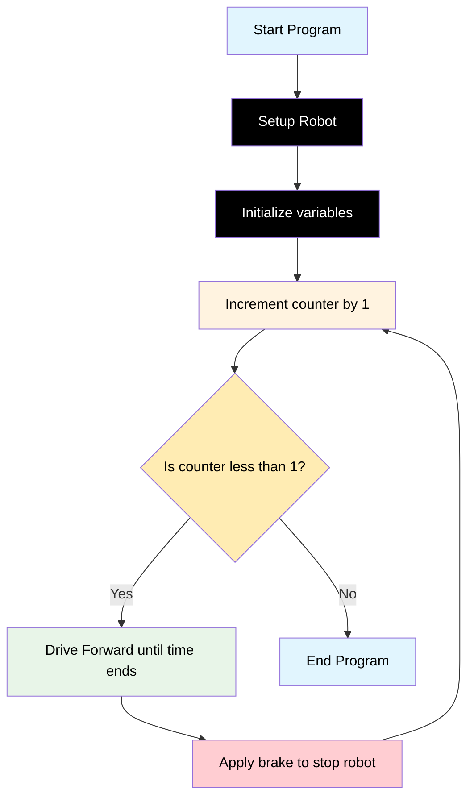

# Challenge 2

In this challenge, students will modify their existing code so that their robot moves in a perfect circle with an approximate diameter of 1500mm and then comes to a stop.

## Success Criteria

My robot moves in circle and comes to a stop.

## Before You Begin

1. Complete [Module 2: Calculations and Turtle!](https://groklearning.com/learn/python-for-beginners/2/0/) to learn about mathematical calculations in the Python language.
2. Complete [Blockly Level 3](https://blockly.games/maze?lang=en&level=3&&skin=0) to apply the run once algorithm visually.

## Flowchart Of The Algorithm



## Step 1

1. Make sure your battery power switch is off.
2. Navigate to [https://lab-micropython.arduino.cc/](https://lab-micropython.arduino.cc/).
3. Sign in with Google (use your @education.nsw.gov.au account).
4. Follow these instructions to connect, code and save:


## Step 2

Because the `while True:` control loop runs forever, we need to add a logic control structure, so it only runs once then stops.

```python
from time import sleep
from aidriver import AIDriver

my_robot = AIDriver()

my_counter = 0
wheel_speed = 180
speed_adjust = 0
move_time = 0

while my_counter <= 1:
    my_robot.backward(wheel_speed - speed_adjust, wheel_speed + speed_adjust)
    sleep(move_time)
    my_robot.brake()
    sleep(1)
    my_counter = my_counter + 1
```

## Step 3

Your challenge is to:

1. Review the math behind my_robot.drive_forward(L, R) and modify the values assigned to wheel_speed and speed_adjust so your robot moves in the desired circle size.
2. Update the value of move_time so the robot travels for approximately the time needed to complete one full circle.

> [!Caution]
> To avoid damaging your computer or robot, first save your main.py file. Next, disconnect your robot from your computer, then place it on the floor in an area with enough space for it to move safely before powering it on.

## Step 4 Save Your Code

1. Copy all your code from `main.py`.
2. Paste it in your portfolio under "Challenge 2".

## Challenge 2 Extensions, I can…

1. Drive a circle both directions.
2. Drive a circle in reverse.
3. Drive 2, 3, 4 circles
4. Drive a figure 8.
5. Drive a circle in reverse.
6. Drive 2, 3, 4 circles
7. Drive a figure 8.
