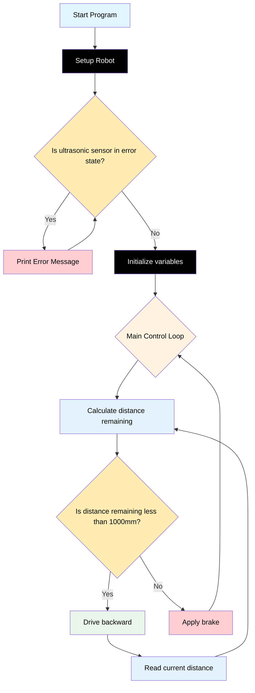

# Challenge 3

In this challenge students will use the distance sensors to control how far the robot moves backwards from an object before coming to a stop.

## Success Criteria

My Robot moves 1000mm away from an object then comes to a stop.

## Before You Begin

1. Complete [Module 3: Asking questions and making decisions!](https://groklearning.com/learn/python-for-beginners/2/0/) to learn about asking questions and making decisions in the Python language.

## Flowchart Of The Algorithm



## Step 1

1. Make sure your battery power switch is off.
2. Navigate to [https://lab-micropython.arduino.cc/](https://lab-micropython.arduino.cc/).
3. Sign in with Google (use your @education.nsw.gov.au account).
4. Follow these instructions to connect, code and save:


## Step 2

Extend your code from Challenge 2 to use the ultrasonic sensor to determine whether the robot needs to reverse in order to position itself 1000mm away from the object it started next to. The robot should measure its distance, then reverse as needed until it is 1000mm from the starting object.

> [!important]
> The ultrasonic sensor will return `-1` if it is too close (less than 20mm) or too far (more that 2000mm) or in an error state.

```python
from time import sleep
from aidriver import AIDriver

my_robot = AIDriver()

while my_robot.read_distance() == -1:
    print ("Robot too close, too far or sensor is in error state")

my_counter = 0
start_distance = my_robot.read_distance()
current_distance = start_distance
distance_remaining = current_distance - start_distance
wheel_speed = 120
speed_adjust = 0
target_distance = 0

while True:
    while distance_remaining < target_distance:
        my_robot.drive_backward(wheel_speed - speed_adjust, wheel_speed + speed_adjust)
        current_distance = my_robot.read_distance()
        sleep(0.1)
        distance_remaining = current_distance - start_distance
    my_robot.brake()
    sleep(1)
    print(my_robot.read_distance()) #debug statement
    sleep(0.1)
```

## Step 3

Your challenge is to:

1. Review the algorithm math behind my_robot.drive_forward(L, R) and modify the values assigned to `target_distance` to achieve the required distance.
2. Modify the code to achieve the following:
   1. Drive forward if the robot is more than 1000mm from the object.
   2. Progressively decelerate the robot to a stop at the correct distance.

> [!Caution]
> To avoid damaging your computer or robot, first save your main.py file. Next, disconnect your robot from your computer, then place it on the floor in an area with enough space for it to move safely before powering it on.

## Step 4 Save Your Code

1. Copy all your code from `main.py`.
2. Paste it in your portfolio under "Challenge 3".
