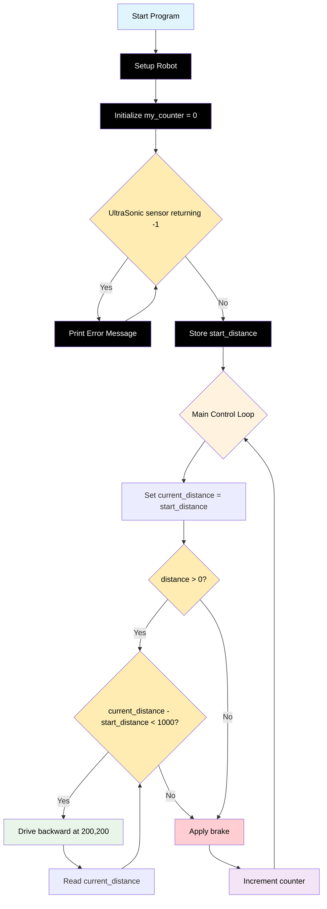

# Challenge 3

In this challenge students will use the distance sensors to control how far the robot moves backwards from an object before coming to a stop.

## Success Criteria

My Robot moves 1m away from an object then comes to a stop.

## Before You Begin

1. Complete [Module 3: Asking questions and making decisions!](https://groklearning.com/learn/python-for-beginners/2/0/) to learn about asking questions and making decisions in the Python language.
2. Complete [Blockly Level 3 to apply the run once algorythm algorithm visually](https://blockly.games/maze?lang=en&level=3&&skin=0).

## Flowchart Of The Algorithm



## Step 1

1. Make sure your power switch is off.
2. Navigate to [https://lab-micropython.arduino.cc/](https://lab-micropython.arduino.cc/).
3. Sign in with Google (use your @education.nsw.gov.au account).
4. Follow these instructions to connect, code and save:


## Step 2

Extend

> [!important]
> The ultrasonic sensor will return `-1` if it is too close (less than 20mm) or too far (more that 2000mm) or in an error state.

```python
from time import sleep
from aidriver import AIDriver

my_robot = AIDriver()

my_counter = 0

while driver.read_distance() == -1
    print ("Robot too close, too far or Sensor in Error state")

start_distance = driver.read_distance()

while True:
    current_distance = start_distance
    if distance > 0:
        while current_distance - start_distance < 1000:
            my_robot.backward(200, 200)
            sleep(0.1)
            current_distance = driver.read_distance()
    my_robot.brake()
    sleep(1)
    my_counter = my_counter + 1
```

## Challenge 2 extension, I can…

1. Progressively accelerate my robot to full speed.
2. Progressively decelerate my robot to a stop.
3. Progressively accelerate my robot to full speed.
4. Progressively decelerate my robot to a stop.
