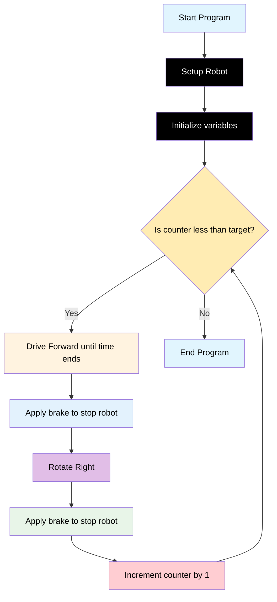

# Challenge 4

In this challenge students will use the distance sensors to control how far the robot moves backwards from an object before coming to a stop.

## Success Criteria

1. My robot drives in a straight line for 1m
2. My robot comes to a standstill then turns 90 degrees
3. My robot does this exactly 4 times to make a square

## Before You Begin

1. Complete [Module 6: Loopy loops!](https://groklearning.com/learn/python-for-beginners/6/0/)
2. Complete [Blockly Level 4](https://blockly.games/maze?lang=en&level=4&&skin=0) to apply the algorithm visually.

## Flowchart Of The Algorithm



## Step 1

1. Make sure your battery power switch is off.
2. Navigate to [https://lab-micropython.arduino.cc/](https://lab-micropython.arduino.cc/).
3. Sign in with Google (use your @education.nsw.gov.au account).
4. Follow these instructions to connect, code and save:


## Step 2

Extend your code from Challenge 2 to use the ultrasonic sensor to determine whether the robot needs to reverse in order to position itself 1000mm away from the object it started next to. The robot should measure its distance, then reverse as needed until it is 1000mm from the starting object.

> [!important]
> The ultrasonic sensor will return `-1` if it is too close (less than 20mm) or too far (more that 2000mm) or in an error state.

```python
from time import sleep
from aidriver import AIDriver

my_robot = AIDriver()

while driver.read_distance() == -1
    print ("Robot too close, too far or sensor is in error state")

my_counter = 0
target_counter = 4
wheel_speed = 200
speed_adjust = 0
forward_time = 0
turn_speed = 200
turn_time = 0

while True:
   while my_counter < target_counter:
      my_robot.backward(wheel_speed - speed_adjust, wheel_speed +  speed_adjust)
      sleep(forward_time)
      my_robot.brake()
      sleep(3)
      robot.rotate_right(turn_speed)
      my_robot.brake()
   sleep(1)
```

## Step 3

Your challenge is to:

1. Review the code and modify the values assigned to the setup variables to achieve the success criteria.
2. Once you have achieved it, modify the code so:
   1. The robot does not turn at the end of the last run of the square.
   2. The 1000mm distance is calculated using the ultrasonic sensor.

> [!Caution]
> To avoid damaging your computer or robot, first save your main.py file. Next, disconnect your robot from your computer, then place it on the floor in an area with enough space for it to move safely before powering it on.

## Step 4 Save Your Code

1. Copy all your code from `main.py`.
2. Paste it in your portfolio under "Challenge 4".
