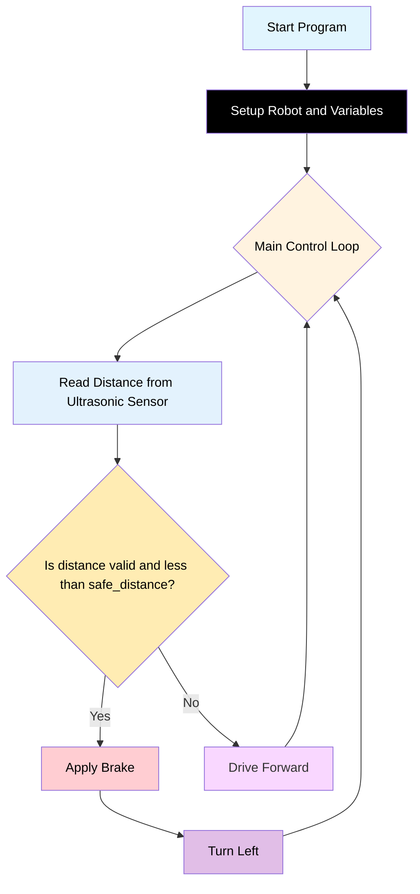

# Challenge 5:

In this challenge, students will use the ultrasonic sensor to detect obstacles in front of the robot and program it to avoid them by stopping and turning away.

## Success Criteria

1. My robot drives forward until it detects an obstacle within 300mm.
2. My robot stops before hitting the obstacle.
3. My robot turns (left or right) to avoid the obstacle, then continues driving forward.

## Before You Begin

1. Complete [Module 8: Functions, fills, and pizza!](https://groklearning.com/learn/python-for-beginners/8/0/)
2. Complete [Blockly Levels 7](https://blockly.games/maze?lang=en&level=7&&skin=0) & [Blockly Levels 9](https://blockly.games/maze?lang=en&level=9&&skin=0) to apply the algorithm visually.

## Flowchart Of The Algorithm



## Step 1

1. Set up your robot and connect to the coding environment as before.

## Step 2

Write code so your robot:

- Drives forward.
- Uses the ultrasonic sensor to check for obstacles.
- If an obstacle is detected within 300mm, the robot stops, turns, and continues forward.

```python
from time import sleep
from aidriver import AIDriver

my_robot = AIDriver()

my_counter = 0
wheel_speed = 200
speed_adjust = 0
turn_speed = 200
turn_time = 0
safe_distance = 0

def turn_left():
    #implement 90 degree left turn here

def drive_forward():
    #implement drive forward here

def brake():
    my_robot.brake()
    sleep(3)

while True:
    distance = my_robot.read_distance()
    if distance != -1 and distance < safe_distance:
        brake()
        turn_left()
    else:
        drive_forward()
```

## Step 3

- Test and adjust the distance threshold and turn timing as needed.
- Try different turn directions or randomize the turn for more advanced behaviour.

## Step 4 Save Your Code

1. Copy all your code from `main.py`.
2. Paste it in your portfolio under "Challenge 5".
