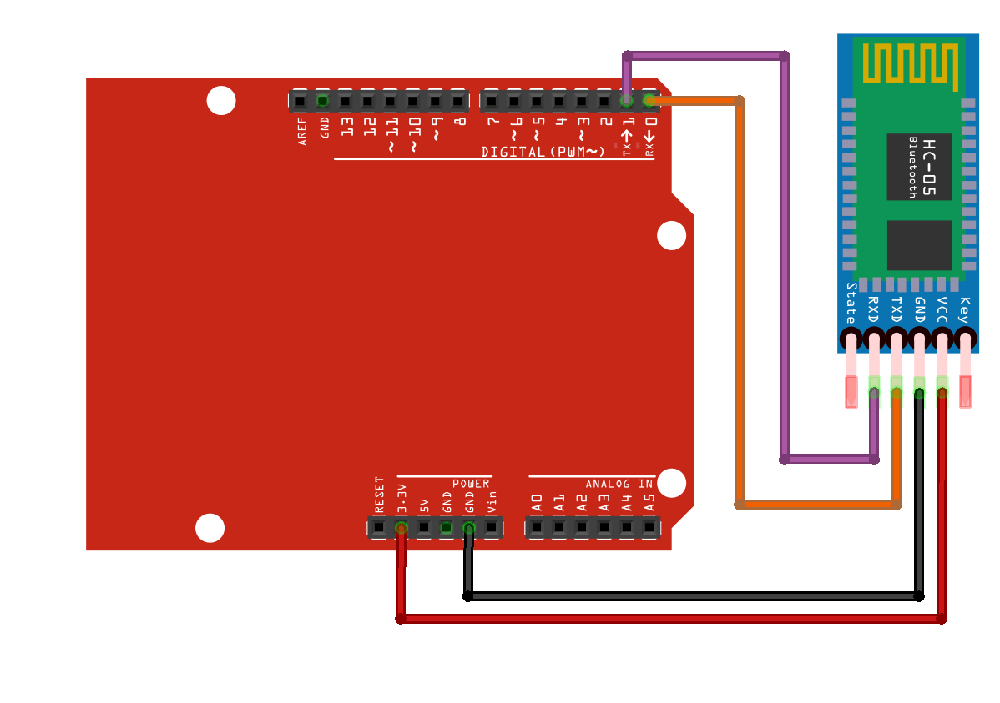

# Challenge 7



- Vcc -------> 3.3V or 5V
- GND -------> GND
- RX --------> Pin 1
- TX --------> Pin 0

## Mobile GamePad App

- [Dabble for iPhone](https://apps.apple.com/us/app/dabble-bluetooth-controller/id1472734455)
- [Dabble for Android](https://play.google.com/store/apps/details?id=io.dabbleapp&hl=en_AU)

```python
from gamepad_pico import GamePad
import utime

gamepad = GamePad()

while True:
    gamepad.poll()
    if gamepad.is_start_pressed():
        print("START pressed")
    if gamepad.is_up_pressed():
        print("UP pressed")
    x = gamepad.get_x()
    y = gamepad.get_y()
    if x != 0 or y != 0:
        print("Joystick X:", x, "Y:", y)
    utime.sleep_ms(100)
```

```python
from aidriver import AIDriver
from gamepad_pico import GamePad
from gamepad_driver_controller import GamepadAIDriverController

from time import sleep_ms

gamepad = GamePad()      # Default UART0: TX=GP0, RX=GP1
driver = AIDriver()      # Default motor/sensor pins as per aidriver.py

controller = GamepadAIDriverController(gamepad, driver)

while True:
    controller.update()
    sleep_ms(40)  # ~25Hz update rate
except KeyboardInterrupt:
    driver.brake()
```
