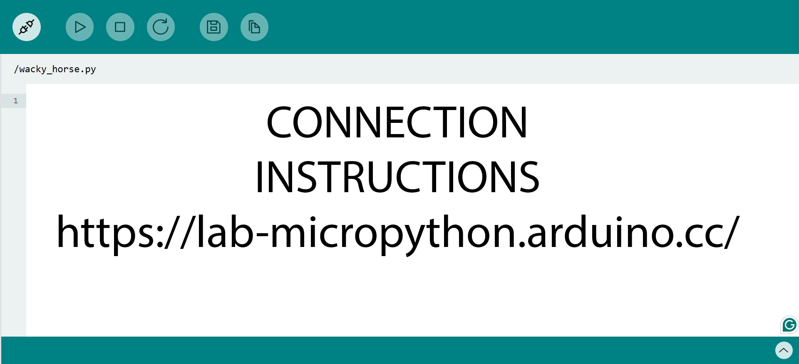

# Challenge 7

In this extension challenge, students will modify their robot to attach a Bluetooth communications module and upload code to remote control their robot.

## Success Criteria

I can connect to my robot via Bluetooth and control it with the _Dabble_ application.

## Step 1, Add the Bluetooth Module


- Vcc -------> 3.3V or 5V
- GND -------> GND
- RX --------> Pin 1
- TX --------> Pin 0

## Step 2, upload the code

1. Make sure your battery power switch is off.
2. Navigate to [https://lab-micropython.arduino.cc/](https://lab-micropython.arduino.cc/).
3. Sign in with Google (use your @education.nsw.gov.au account).
4. Follow these instructions to connect, code and save:



```python
from gamepad_pico import GamePad
import utime

gamepad = GamePad()

while True:
    gamepad.poll()
    if gamepad.is_start_pressed():
        print("START pressed")
    if gamepad.is_up_pressed():
        print("UP pressed")
    x = gamepad.get_x()
    y = gamepad.get_y()
    if x != 0 or y != 0:
        print("Joystick X:", x, "Y:", y)
    utime.sleep_ms(100)
```

If you get stuck with errors using this code, see `Common_Errors.md`.

```python
import aidriver
from aidriver import AIDriver
from gamepad_pico import GamePad
from gamepad_driver_controller import GamepadAIDriverController

from time import sleep_ms

aidriver.DEBUG_AIDRIVER = True

gamepad = GamePad()      # Default UART0: TX=GP0, RX=GP1
driver = AIDriver()      # Default motor/sensor pins as per aidriver.py

controller = GamepadAIDriverController(gamepad, driver)

try:
    while True:
        controller.update()
        sleep_ms(40)  # ~25Hz update rate
except KeyboardInterrupt:
    driver.brake()
```

If you see errors about names or attributes here, check `Common_Errors.md`.

## Step 3, install the Dabble Mobile GamePad App

- [Dabble for iPhone](https://apps.apple.com/us/app/dabble-bluetooth-controller/id1472734455)
- [Dabble for Android](https://play.google.com/store/apps/details?id=io.dabbleapp&hl=en_AU)

## Step 4, connect your phone

1. Turn on your robot
2. Open the _Dabble_ application
3. Click the connect icon in the top menu and select the HC-05 form the list of Bluetooth devices
4.
