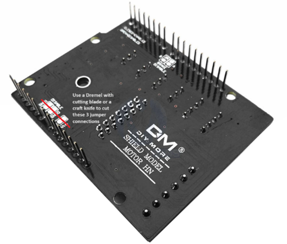
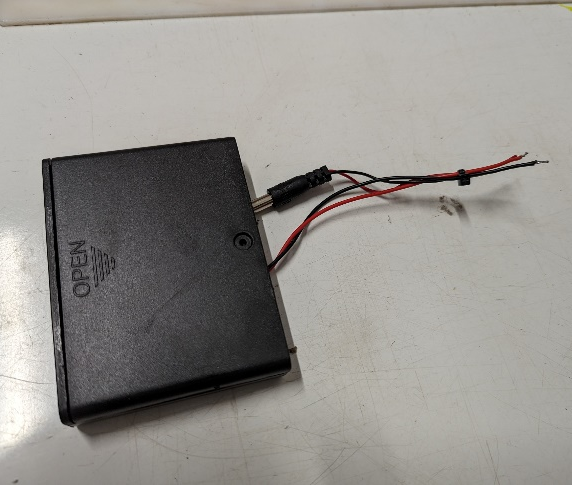
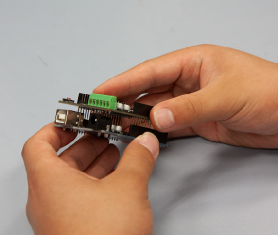

# AIDriver

A low-cost, easy-to-assemble differential drive robot, specifically designed for students. This platform provides hands-on experience with fundamental mechatronic components, robot construction, and introductory programming for mechatronics applications.

**🎮 Try the [Web Simulator](https://tempehs.github.io/AIDriver_MicroPython_Challanges/) to test your code without hardware!**

## Build The Robot

### Components

All components can be purchased from [AliExpress](https://www.aliexpress.com/) and the chassis manufactured using a 3D Printer and Laser cutter.

1. [Laser cut chassis](manufacturing_files/LC_Faculty_AIDriverGluelessv2_PP.pdf) using [(3mm Ply)](https://www.bunnings.com.au/2440-x-1220mm-3mm-plywood-pine-premium-bc-grade_p0340267)
2. [3D Printed components](docs/manufacturing_files)
3. [Ultrasonic Sensor](https://www.aliexpress.com/item/1005005636789307.html)
4. [RP2040 Uno Development Board](https://www.aliexpress.com/item/1005009315359179.html)
5. [Omni Wheel](https://www.aliexpress.com/item/32954940078.html)
6. [L298NH Motor Shield](https://www.aliexpress.com/item/32801279582.html)
7. 4x [Dupoint Cables](https://www.aliexpress.com/item/4000053353555.html)
8. 2x [TT Tyre](https://www.aliexpress.com/item/1005005767062155.html)
9. 2x [TT DC plastic geared motor](https://www.aliexpress.com/item/1005004854068015.html)
10. [5x2.1 Barrel Jack](https://www.aliexpress.com/item/33024967273.html)
11. [6x AA Battery Holder with Switch](https://www.aliexpress.com/item/4001266904978.html)
12. 6x AA Batteries

### Preparation

> [!Note]
> TempeHS Senior Software Engineering students have already completed these steps.

| 1                                                                                                       | 2                                                                                                                    | 3                                                                                                                                             |
| ------------------------------------------------------------------------------------------------------- | -------------------------------------------------------------------------------------------------------------------- | --------------------------------------------------------------------------------------------------------------------------------------------- |
| Using a precision knife, cut the VIN jumpers on underside of the motor shield and test with multimeter. | Cut 9v snap and solder cables to battery pack cables (red to red & black to black) then secure with small cable tie. | Fit motor shield to the headers, then build custom MicroPython firmware with integrated AIDriver libraries using the automated build process. |
|                                    |                         |                                                |

### Assembly & Testing

Detailed assembly instructions including hardware testing can be found in the [Assembly_Instructions.md](Assembly_Instructions.md)

### Building Custom Firmware

Build MicroPython firmware with your custom AIDriver libraries integrated. The build system creates firmware with libraries frozen for fast loading and `main.py` on the filesystem for IDE editing.

**🚀 Quick Build (Recommended):**

```bash
cd /workspaces/AIDriver_MicroPython_Challanges/.devcontainer
./build_firmware.sh
```

**�️ Recovery Mode:** If `main.py` becomes corrupted, connect **GPIO pin 4 to ground** during boot to restore the original code.

**📖 Complete Documentation:** [Build_Custom_MicroPython_Firmware.md](Build_Custom_MicroPython_Firmware.md) - Comprehensive build guide with recovery features

### Debugging & Event Logging

- Turn on richer console output by setting `aidriver.DEBUG_AIDRIVER = True` in your `main.py`. The library prints sensor sanity checks, motor actions, and student-friendly error hints without changing behaviour.
- Every boot creates a run-once `event_log.txt` next to `main.py`. It records high-level actions (drive/rotate/brake) with human-readable speed bands and notes when speeds are too low to move or will arc left/right. Clear or delete the file to capture the next run.
- In recovery mode (GPIO4 held low during boot), both `main.py` and `event_log.txt` are restored to their defaults so students start from a clean slate.

### Challenges

Once students have assembled their robot they are to complete the programming challenges to build their skills in programming mechatronics before designing a vehicle automation project.

**🎮 Web Simulator:** Test your code before uploading to the robot using the [AIDriver Simulator](https://tempehs.github.io/AIDriver_MicroPython_Challanges/) - no hardware required!

1. [Challenge 1](Challenge_1.md) - Drive in a straight line
2. [Challenge 2](Challenge_2.md) - Drive in a large circle
3. [Challenge 3](Challenge_3.md) - Autonomous collision prevention
4. [Challenge 4](Challenge_4.md) - Drive in a square
5. [Challenge 5](Challenge_5.md) - Autonomous obstacle avoidance
6. [Challenge 6](Challenge_6.md) - Autonomous maze navigation
7. [Challenge 7](Challenge_7.md) - Remote control

## Authors

[@benpaddlejones](https://github.com/benpaddlejones)

## License

<p xmlns:cc="http://creativecommons.org/ns#" xmlns:dct="http://purl.org/dc/terms/"><a property="dct:title" rel="cc:attributionURL" href="https://github.com/TempeHS/AIDriver_MicroPython_Challanges">AIDriver_MicroPython_Challanges</a> by <a rel="cc:attributionURL dct:creator" property="cc:attributionName" href="https://github.com/benpaddlejones">Ben Jones</a> is licensed under <a href="https://creativecommons.org/licenses/by-nc-sa/4.0/?ref=chooser-v1" target="_blank" rel="license noopener noreferrer" style="display:inline-block;">Creative Commons Attribution-NonCommercial-ShareAlike 4.0 International</a></p>
